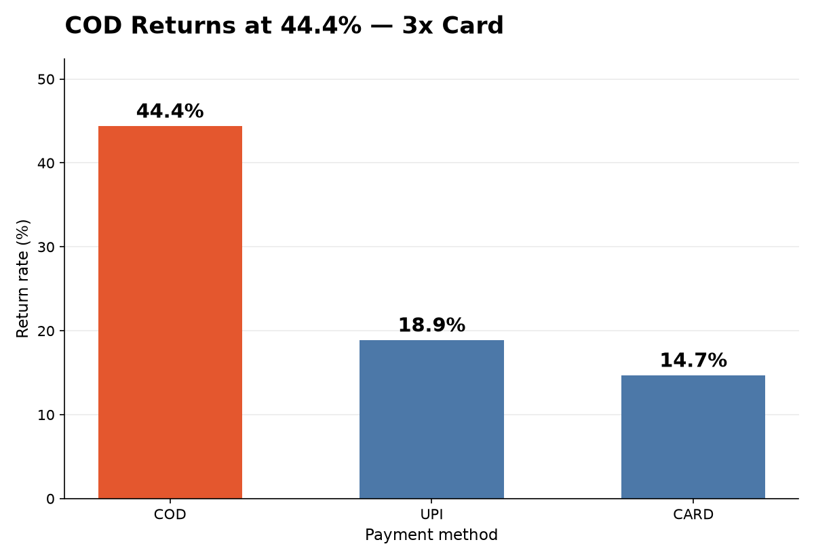
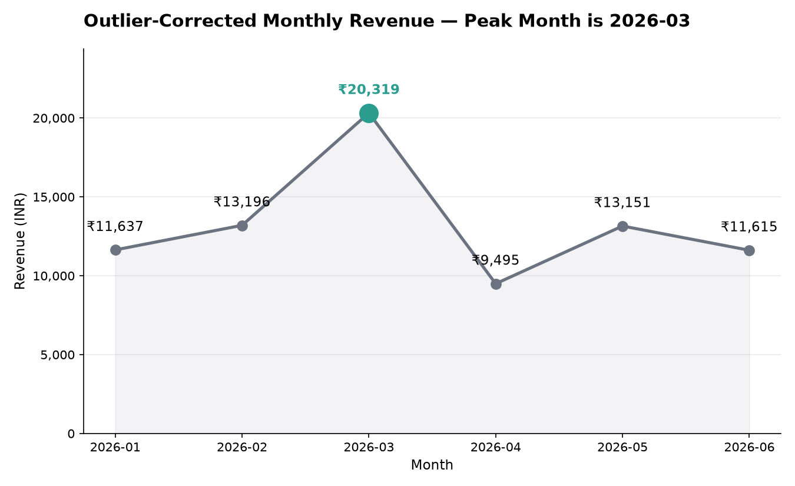

# 📦 Mamaearth Returns & Growth Intelligence Pipeline

**SQL → Python → GenAI**, one connected repo that answers a simple question: *where are returns eating into margins?*

Capstone project · Data Analytics with AI & Gen AI · E&ICT Academy IIT Roorkee

---

## 🔎 The answer in 30 seconds

| What we found | Number |
|---|---|
| Cleaned revenue (175 orders) | **Rs 97,358.30** |
| Revenue lost to duplicate double-submit orders | **Rs 2,501.90** (5 orders) |
| COD return rate | **44.4%** (Card 14.7%, UPI 18.9%) |
| Highest-risk segment | **COD + Tier-2 cities at 54.5%** |
| Real peak month | **March, Rs 20,318.90** |
| January's "peak" | an artifact of 2 bulk orders (Rs 29,582.10 → Rs 11,637.10 without them) |

<p align="center">
  
  
</p>

---

## 🧭 How the three layers connect

```mermaid
flowchart LR
    A[data/*.csv<br/>raw files] --> B[SQL layer<br/>SQLite + reports]
    A --> C[Python layer<br/>clean + EDA]
    B -. raw total Rs 99,860.20 .-> C
    C --> D[visualizations/*.png]
    C -->|writes| E[narrator/findings.json]
    E --> F[GenAI narrator<br/>Situation / Complication / Resolution]
```

1. **SQL** loads the raw csv files into SQLite and gives the raw numbers (for example Rs 99,860.20 on 180 orders).
2. **Python** reads the same csv files, cleans them, and gets Rs 97,358.30 on 175 orders. The Rs 2,501.90 gap is fully explained by the 5 duplicates removed. Its last step writes `narrator/findings.json`.
3. **Narrator** reads only `findings.json`, so every number in the narrative comes from the layer before it.

The Python part reads the csv files directly (not the database), so steps 1 and 2 can be run in either order. Step 3 needs `findings.json`, so run step 2 before it.

---

## 🗂️ Repo structure

```
README.md
sql/
    schema.sql        creates the 3 tables
    seed_data.sql     INSERT statements generated from the csv files
    reports.sql       reports (a) to (i), output pasted above each query
data/
    customers.csv, products.csv, orders.csv   (raw files, not edited)
analysis/
    clean_and_eda.py  cleaning + EDA, also writes narrator/findings.json
    visualize.py      makes the two charts
visualizations/
    return_rate_by_payment.png
    monthly_revenue_trend.png
narrator/
    findings.json          numbers passed on to the narrator (written by code)
    generate_narrative.py  Situation / Complication / Resolution narrative
    sample_output.txt      saved narrative that the number checker is run on
```

---

## ▶️ How to run (from the repo root)

You need Python 3 and the `sqlite3` command line tool. Install the Python libraries first:

```
pip install -r requirements.txt
```

### Step 1: SQL

```
sqlite3 mamaearth.db < sql/schema.sql
sqlite3 mamaearth.db < sql/seed_data.sql
sqlite3 -header -column mamaearth.db < sql/reports.sql
```

After loading there should be 45 customers, 16 products and 180 orders. Blank discount and rating cells are loaded as NULL. `reports.sql` has an ALTER TABLE at the end, so to run it a second time run `schema.sql` again first (it drops and recreates the tables).

### Step 2: Python analysis

```
python analysis/clean_and_eda.py
python analysis/visualize.py
```

`clean_and_eda.py` prints every step. Task 5's total and the other results are saved to `narrator/findings.json` by the last step of this script. `visualize.py` saves the two charts in `visualizations/`.

### Step 3: GenAI narrator

With no API key (offline version, no network needed):

```
python narrator/generate_narrative.py
```

With a Gemini key (free key from Google AI Studio; the `google-genai` library comes from requirements.txt):

```
export GEMINI_API_KEY="your-key"
python narrator/generate_narrative.py
```

On Windows PowerShell use `$env:GEMINI_API_KEY="your-key"` instead of export. If the Gemini call fails, the script prints the error and uses the offline version. After the narrative it prints PASS or FAIL for each of the 5 required figures.
